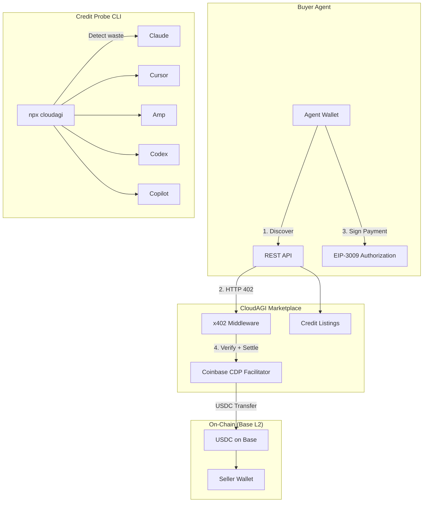

# CloudAGI — Agent Credit Economy

**The first marketplace for tokenizing and trading unused AI agent compute credits with on-chain settlement.**

> Built for [The Synthesis Hackathon](https://synthesis.devfolio.co) (Mar 13-22, 2026)
> Track: Agents That Pay | Agents That Trust

## The Problem

Engineers pay $20-200/month for coding agent subscriptions (Claude Code, Cursor, Amp, Codex, Copilot) and routinely waste 50-80% of their credits. Meanwhile, others need AI compute but don't want monthly commitments.

**$228/month in wasted credits** across a typical 8-subscription developer setup. No way to recover that value — until now.

## The Solution

CloudAGI is an agent-to-agent credit marketplace where:

1. **Sellers** list unused credits from any AI provider
2. **Buyer agents** discover listings via API
3. **Payment** settles instantly on Base L2 via x402 + USDC
4. **No intermediary** can freeze the marketplace — fully on-chain settlement

```
Buyer Agent                CloudAGI Marketplace              Seller
    |                              |                           |
    | GET /listings                |                           |
    |----------------------------->|                           |
    | 200 + available credits      |                           |
    |<-----------------------------|                           |
    |                              |                           |
    | GET /credits/purchase        |                           |
    |----------------------------->|                           |
    | 402 + USDC payment details   |  (x402 protocol)         |
    |<-----------------------------|                           |
    |                              |                           |
    | GET /credits/purchase        |                           |
    | + signed EIP-3009 payment    |                           |
    |----------------------------->|                           |
    |              Coinbase CDP Facilitator settles USDC       |
    |                              |-------------------------->|
    | 200 + credit access token    |                           |
    |<-----------------------------|                           |
```

## Architecture



## Components

### CLI Probe (`v1/`)
Detects unused AI credits across 5 providers. Runs locally, reads credential files.

```bash
npx cloudagi
```

```
┌───────────┬──────┬────────┬────────────┬──────────────┐
│ Provider  │ Plan │ Used % │ Wasted $   │ Sell Window  │
├───────────┼──────┼────────┼────────────┼──────────────┤
│ Claude    │ Max  │ 48%    │ $52.00     │ 🔴 MASSIVE   │
│ Cursor    │ Pro  │ 30%    │ $14.00     │ 🟡 MEDIUM    │
│ Amp       │ Pro  │ 20%    │ $16.00     │ 🔴 MASSIVE   │
│ Codex     │ Plus │ 55%    │ $9.00      │ 🟡 MEDIUM    │
│ Copilot   │ Ind  │ 40%    │ $6.00      │ 🟠 HIGH      │
├───────────┼──────┼────────┼────────────┼──────────────┤
│ TOTAL     │      │        │ $97.00/mo  │              │
└───────────┴──────┴────────┴────────────┴──────────────┘
```

- 5 provider plugins (Claude, Cursor, Amp, Codex, Copilot)
- paceRatio algorithm for sell window classification
- Guardian SDK for credential safety (HMAC sealing, tamper detection)
- 119 tests passing

### Web Marketplace (`web/`)
Hono-based API server with x402 payment integration.

**Endpoints:**

| Route | Method | Description |
|-------|--------|-------------|
| `/api/marketplace/listings` | GET | Browse available credit listings |
| `/api/marketplace/listings` | POST | Create a listing (sellers) |
| `/api/marketplace/orders` | POST | Purchase credits |
| `/api/x402/credits/purchase` | GET | **x402-gated** — returns 402 with USDC payment requirements |
| `/api/x402/credits/info` | GET | Payment protocol info |
| `/api/health` | GET | Health check |
| `/auth/github` | GET | GitHub OAuth login |

- x402 payment middleware (Coinbase CDP facilitator)
- USDC settlement on Base (testnet + mainnet)
- GitHub OAuth + JWT authentication
- 68 tests passing

### Buyer Agent (`web/src/agent/buyer.ts`)
Autonomous agent that discovers and purchases credits without human intervention.

```bash
BUYER_PRIVATE_KEY=0x... bun run src/agent/buyer.ts
```

## Quick Start

```bash
# Clone
git clone https://github.com/aryateja2106/cloudagi
cd cloudagi

# Run the CLI probe
cd v1 && bun install && bun run dev

# Run the marketplace server
cd web && bun install
cp .env.example .env  # Configure wallet address
bun run dev

# Run buyer agent (separate terminal)
cd web
BUYER_PRIVATE_KEY=0x... bun run src/agent/buyer.ts
```

### Environment Variables

```
SELLER_WALLET_ADDRESS=0x...     # Wallet receiving USDC payments
FACILITATOR_URL=https://x402.org/facilitator
X402_NETWORK=base-sepolia       # or "base" for mainnet
GITHUB_CLIENT_ID=               # GitHub OAuth
GITHUB_CLIENT_SECRET=
JWT_SECRET=
```

## Hackathon Track Alignment

### Agents That Pay (Primary)
- On-chain USDC settlement via x402 protocol
- Auditable payment receipts (BaseScan transaction links)
- Programmable spending — agents pay autonomously via signed EIP-3009 authorizations
- No intermediary can freeze payments

### Agents That Trust (Secondary)
- Marketplace listings are discoverable via standard REST API
- Agent reputation via transaction history
- Open-source verification of all marketplace logic

### CROPS Compliance
- **C**ensorship Resistant — No single platform can block the marketplace
- **O**pen Source — MIT licensed, fully auditable
- **P**rivacy — Sellers expose capacity, not usage patterns
- **S**ecurity — x402 facilitator verifies payments cryptographically

## Tech Stack

| Component | Technology |
|-----------|-----------|
| Runtime | Bun 1.3 |
| Server | Hono 4.7 |
| Payments | x402 v2.7 (Coinbase) |
| Settlement | USDC on Base L2 |
| Wallet | viem 2.47 |
| Auth | GitHub OAuth + JWT |
| CLI | Commander.js |
| Tests | Bun test (187 passing) |

## Roadmap

- [ ] ERC-1155 credit tokens — represent credits as tradeable on-chain assets
- [ ] Uniswap pool integration — price discovery for credit tokens
- [ ] ERC-8004 agent identity — trustless agent verification
- [ ] Dynamic pricing — per-listing x402 price based on market rates
- [ ] Locus integration — unified payment infrastructure
- [ ] OG Foundation compute — decentralized compute supply ($80M fund)

## Origin

First conceived during the [Nevermined Autonomous Business Hackathon](https://github.com/shlawgathon/Hackaton-CloudAGI) (Mar 5-6, 2026) in SF, where the team built agent-to-agent commerce with 21+ purchases from 5 teams using x402.

## Team

- **Arya Teja** — [@aryateja2106](https://github.com/aryateja2106) — Agentic Engineer, SF
- **Daniel** — [@moona3k](https://github.com/moona3k) — Collaborator

## License

MIT
